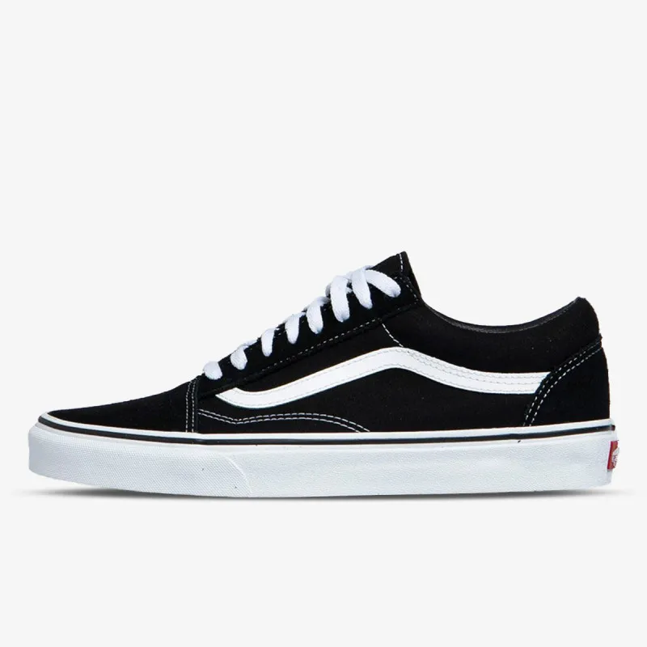
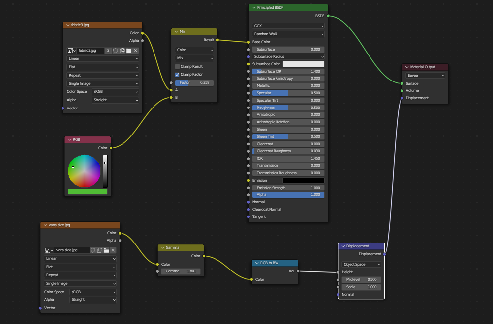
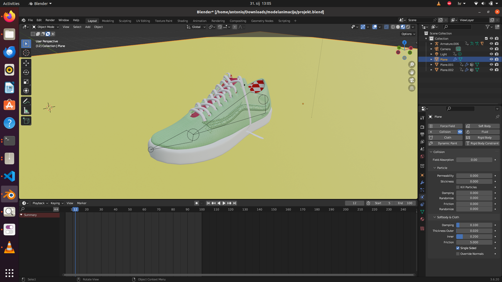

Antonio Škara, 3D modeliranje i animacija, 2024/2025 
# Animacija i simulacija tenisica 
# Modeliranje 
Tenisice sam dizajnirao prema modelu Vans tenisica “Old-skool”. A referencu sam koristio sljedeće slike. 

  

*Slika 1. Vans Old Skool, referentne slike* 

Tenisice su modelirane kombinacijom poligonalnog i modeliranja krivulja. A vezice su napravljene poligonalnim modeliranjem(ekstrudiranjem). 

Tenisice se sastoji od tri dijela: Tijela, Potplate i Vezica. A zadnja dva su spojena roditeljskim odnosima na tijelo. 
# Teksturiranje 
Za teksturiranje je korištena tekstura tekstila skinuta skinuta sa interneta. A bijela linija je postavljena Uv map metodom. 

*Slika 2. Čvorovi korišteni za teksturiranje bijele linije* 
# Fizika 
Dinamika vezica je simulirana kao Cloth modifierom. Pri tome je je povećan parametar pressure i bending kako bi vezice bolje odgovarale stvarnima. Tijelo i potplate su modelirane kao Collision. 

*Siika 3. Tenisice s vezicama u blenderu* 
# Animacija 
Vezica je animirana da pleše poznatu varijaciju shuffle plesa. Pri tome je bilo potrebno prikladno obojati težine na tenisicama, kako bi se osigurale da se svi dijelovi(posebno vezice, kreću u skladu sa tijelom). 
